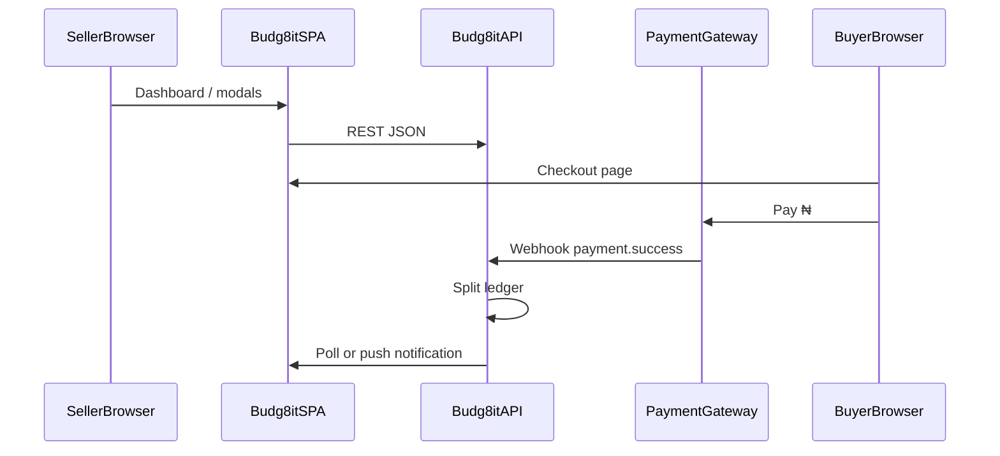
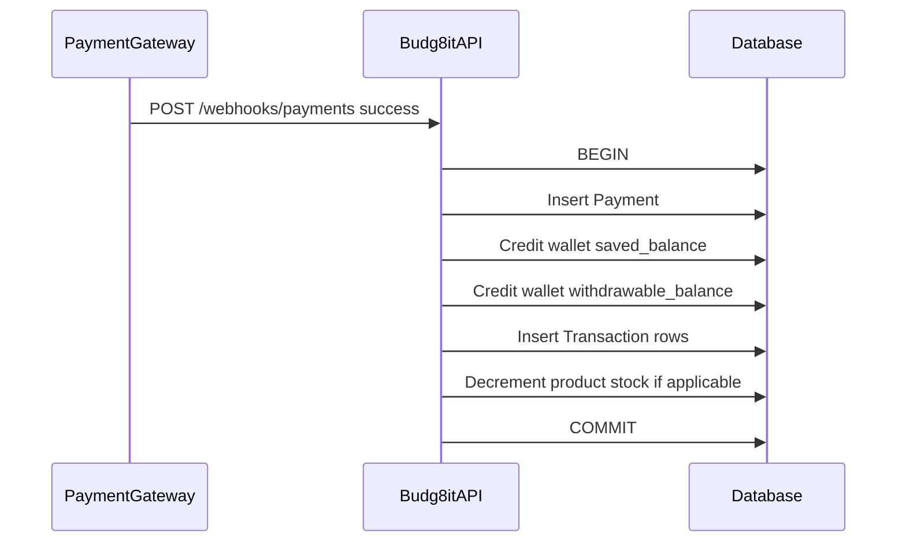

# Budg8it — Software Requirements Specification (SRS)

**Version:** 1.0  
**Date:** May 2026  
**Status:** Draft for development handoff  
**Related document:** [Budg8it-PRD.md](./Budg8it-PRD.md)

---

## 1. Introduction

### 1.1 Purpose

This Software Requirements Specification defines the functional and non-functional requirements for **Budg8it**, a web application that enables Nigerian sellers to collect payments and automatically allocate a configurable percentage of each payment to smart savings wallets.

This document is intended for engineering, QA, DevOps, and solution architects implementing the production system beyond the current React UI prototype.

### 1.2 Scope

| In scope | Out of scope (v1) |
|----------|-------------------|
| React SPA (seller dashboard, modals, marketing pages) | Native mobile apps |
| REST API backend (specified as contracts) | Product description/category (P2) |
| Payment gateway integration (Paystack/Flutterwave) | Multi-currency |
| Wallet ledger and auto-save split engine | Team/multi-user accounts |
| Hosted buyer checkout at `pay.budg8it.com` | Accounting ERP integrations |

### 1.3 Definitions & Acronyms

| Term | Definition |
|------|------------|
| **AUTO-INVEST** | Portion of a payment routed to a savings wallet per auto-save % |
| **WITHDRAWABLE** | Portion of a payment available for seller withdrawal/spend |
| **Auto-save %** | Integer 0–100 configuring split ratio for a wallet or product |
| **Wallet** | Named savings container with balance and transaction history |
| **Product** | Sellable item with price, stock, image, linked wallet, and payment slug |
| **Payment Link** | One-off checkout link not tied to full product catalog metadata |
| **Slug** | URL-safe unique identifier in `pay.budg8it.com/p/{slug}` |
| **GMV** | Gross merchandise value — total payment volume |
| **NDPR** | Nigeria Data Protection Regulation |
| **PCI-DSS** | Payment Card Industry Data Security Standard (delegated to gateway) |

### 1.4 References

| Ref | Document / system |
|-----|-------------------|
| R-1 | [Budg8it-PRD.md](./Budg8it-PRD.md) |
| R-2 | React prototype: `src/` in Budg8it-Homepage repository |
| R-3 | Paystack API documentation (TBD) |
| R-4 | Flutterwave API documentation (TBD) |
| R-5 | qrcode.react library documentation |

---

## 2. Overall Description

### 2.1 Product Perspective

Budg8it is a **browser-based system** comprising:



- **Budg8it SPA:** React 19 + Vite + Tailwind CSS 4
- **Budg8it API:** REST backend (TBD stack: Node, Go, etc.)
- **Payment gateway:** Paystack or Flutterwave
- **Object storage:** Product images (S3-compatible, TBD)

### 2.2 Product Functions Summary

| Function | SRS ID |
|----------|--------|
| User authentication | SRS-AUTH-* |
| Wallet CRUD and balances | SRS-WALLET-* |
| Add Product 3-step wizard | SRS-PROD-* |
| Generate Payment Link modal | SRS-LINK-* |
| Payment collection and split | SRS-PAY-* |
| Seller dashboard | SRS-DASH-* |

### 2.3 User Classes & Characteristics

| Class | Description | Technical access |
|-------|-------------|------------------|
| **Seller** | Registered user managing wallets, products, links | Authenticated JWT/session |
| **Buyer** | Anonymous or identified payer at checkout | Public checkout routes |
| **System** | Webhook processor, cron jobs | Service API keys |
| **Admin** (future) | Support, dispute handling | Separate admin console (P2) |

### 2.4 Operating Environment

| Layer | Requirement |
|-------|-------------|
| Client | Modern browsers; viewport 320px–1920px+ |
| Server | Linux containers; HTTPS TLS 1.2+ |
| Database | Relational (PostgreSQL recommended) |
| CDN | Static assets and product images |
| Region | Primary deployment with low latency to Nigeria |

### 2.5 Constraints

- Currency: **₦ only** in v1 UI and API.
- Custom UI components only (no Material UI / Chakra in requirements).
- Prototype uses client-side slug generation (`buildPaymentUrl.js`); production must use server-authoritative slugs.
- Prototype payment base URL `pay.fintrack.com` must migrate to **`pay.budg8it.com`**.

---

## 3. System Features & Functional Requirements

### SRS-AUTH: Authentication

#### SRS-AUTH-01 — User registration

| Attribute | Specification |
|-----------|---------------|
| **Priority** | P0 |
| **Description** | Create seller account |
| **Inputs** | Email, password, confirm password, terms acceptance |
| **Processing** | Validate email unique; hash password (bcrypt/argon2); create User record |
| **Outputs** | 201 + auth token or session; redirect to dashboard |
| **Errors** | 400 validation; 409 email exists; 429 rate limit |

#### SRS-AUTH-02 — User login

| Priority P0 | Email + password → JWT (exp 24h) or refresh token pattern |

#### SRS-AUTH-03 — Password reset

| Priority P0 | Forgot password email with time-limited token; reset form sets new password |

**UI reference:** `src/pages/SignInPage.jsx`, `SignUpPage.jsx`, `ForgotPasswordPage.jsx`, `ResetPasswordPage.jsx`

---

### SRS-WALLET: Smart Wallet System

#### SRS-WALLET-01 — First wallet onboarding

| Priority | P1 |
| Description | Optional post-sign-up wallet creation |

#### SRS-WALLET-02 — Create wallet

| Attribute | Specification |
|-----------|---------------|
| **Priority** | P0 |
| **Inputs** | `name` (string), `auto_save_percent` (0–100, default 40) |
| **Processing** | Persist Wallet linked to `user_id`; initialize balances 0 |
| **Outputs** | Wallet object with `id`, `name`, `auto_save_percent`, `saved_balance`, `withdrawable_balance` |
| **Errors** | Duplicate name per user (409); invalid percent (400) |

#### SRS-WALLET-03 — Configure auto-save

| Priority P0 | Update `auto_save_percent`; applies to future payments for linked products/links |

#### SRS-WALLET-04 — Wallet balances

| Field | Type | Description |
|-------|------|-------------|
| `saved_balance` | decimal(18,2) | Cumulative AUTO-INVEST (₦) |
| `withdrawable_balance` | decimal(18,2) | Available to withdraw (₦) |
| `auto_save_percent` | int | Display on card (e.g. "25%") |

#### SRS-WALLET-05 — Transaction history

| Priority P0 | List transactions: `id`, `type`, `amount`, `auto_invest`, `withdrawable`, `reference`, `created_at` |

#### SRS-WALLET-06 — Edit wallet

| Priority P1 | PATCH name and/or auto_save_percent |

---

### SRS-PROD: Add Product Wizard

#### SRS-PROD-01 — Step 1: Product details

| Attribute | Specification |
|-----------|---------------|
| **Priority** | P0 |
| **Description** | Capture product fields (as-built UI) |
| **Inputs** | See validation table §6.2 |
| **Processing** | Client validation (Zod); on proceed store draft in modal state; upload image to storage on submit or at Step 3 |
| **Outputs** | `productDraft` object in wizard state |
| **Errors** | Inline field errors below inputs (12px red text) |

**Validation (matches `addProductSchema.js`):**

| Field | Rules |
|-------|-------|
| `productName` | Required, trim, 1–120 chars |
| `price` | Number, ≥ 0 (backend: reject publish if 0) |
| `stocksQuantity` | Integer, ≥ 1 |
| `image` | Optional; types: jpeg, png, gif, webp, mp4, pdf; max 15 MB |

#### SRS-PROD-02 — Step 2: Configure wallet

| Priority P0 |
| Inputs | `auto_save_percent` 0–100, default 40 |
| UI | Slider with gradient track; badges Withdrawable / Auto-invest |
| Processing | `withdrawable_preview = 100 - auto_save_percent` |
| CTA | Advances to Step 3 |

#### SRS-PROD-03 — Step 3: Product live

| Priority P0 |
| Processing | `POST /api/v1/products` with draft + image URL + auto_save → returns `payment_url`, `slug` |
| Outputs | Success UI, `payment_url`, QR (qrcode.react), copy clipboard, PNG download |
| QR download | Hidden `QRCodeCanvas` → `toDataURL('image/png')` → anchor download `product-qr-code.png` |

#### SRS-PROD-04 — Wizard shell

| Requirement | Detail |
|-------------|--------|
| Layout | `AddProductModal.jsx`; max-width 500px; white card |
| Animation | Framer Motion `x: -(step-1)*100%`; duration 0.4s |
| Stepper | `ProductFlowStepper` in modal header; `pt-10` below close button |
| Close | Rounded × button; steps 1–2 only; z-30 |
| Back | Step 2 stepper click step 1 → `setStep(1)` |

**Components:** `AddProductStep.jsx`, `ConfigureWalletStep.jsx`, `ProductLiveStep.jsx`, `ProductFlowStepper.jsx`

---

### SRS-LINK: Generate Payment Link

#### SRS-LINK-01 — Create payment link

| Attribute | Specification |
|-----------|---------------|
| **Priority** | P0 |
| **Inputs** | `purpose`, `price`, `link_to_wallet`, `allocation_method`, `wallet_name?`, `existing_wallet_id?`, `auto_save_percent` |
| **Processing** | Validate; create PaymentLink + Wallet if needed; generate slug |
| **Outputs** | `payment_url`, `link_id` |
| **Modal** | `GeneratePaymentLink.jsx`; max-width 620px; bg `#F5F5F0` |

#### SRS-LINK-02 — Link to Wallet toggle

| ON | Show allocation section with CSS grid height transition |
| OFF | Hide wallet fields; `auto_save_percent` ignored or 0 per business rule |

#### SRS-LINK-03 — Allocation method

| Value | Behavior |
|-------|----------|
| `create` | Show New Wallet Name input; required if toggle ON |
| `existing` | Show wallet select; hide name field |

#### SRS-LINK-04 — Auto-save slider

| UI | `configure-wallet-slider` class; badge `bg-[#E8F5E9]`; ticks 0%, 50%, 100% |

#### SRS-LINK-05 — Validation on submit

| Field | Error condition |
|-------|-----------------|
| `purpose` | Empty → "Payment purpose is required" |
| `price` | ≤ 0 → "Price must be greater than 0" |
| `walletName` | Empty when create + link ON |
| `existingWallet` | Missing when existing + link ON |

**Prototype gap:** `onProceed` currently closes modal only; production must call API then show success UI.

---

### SRS-PAY: Payment Collection

#### SRS-PAY-01 — Checkout page

| Priority P0 |
| URL | `https://pay.budg8it.com/p/{slug}` |
| Display | Title (product name or purpose), price ₦, image if product |
| Action | Initialize gateway transaction |

#### SRS-PAY-02 — Auto-save split

```
auto_invest_amount = round(payment_amount * auto_save_percent / 100, 2)
withdrawable_amount = payment_amount - auto_invest_amount
```

| Priority P0 | Atomic DB transaction: Payment + 2 ledger entries |



#### SRS-PAY-03 — Seller notification

| Priority P1 | Email or push: amount, purpose/product, timestamp |

#### SRS-PAY-04 — Transaction log

| Priority P0 | Immutable append-only ledger per wallet |

#### SRS-PAY-05 — Stock decrement

| Priority P0 | On product payment success: `stocks_quantity -= 1` if > 0; else reject checkout |

---

### SRS-DASH: Dashboard

#### SRS-DASH-01 — Statistics row

| Stat | Source |
|------|--------|
| Total Revenue | Sum completed payments |
| Active Stocks | Sum product `stocks_quantity` |
| Transactions | Count payments |
| Auto Savings | Sum AUTO-INVEST amounts |

**UI:** `StatsRow.jsx` — horizontal scroll on mobile

#### SRS-DASH-02 — Products section

| Priority P0 | Grid of products with payment link actions (copy, etc.) |

#### SRS-DASH-03 — Recent transactions

| Priority P0 | Last N transactions across wallets |

#### SRS-DASH-04 — Quick actions

| Action | Behavior |
|--------|----------|
| Add Product | Open `AddProductModal` |
| Generate Link | Open `GeneratePaymentLink` |
| Store Link | P1 — storefront URL |

#### SRS-DASH-05 — Store link card

| Priority P1 | `StoreLinkCard.jsx` — copy/open store URL |

---

## 4. External Interface Requirements

### 4.1 UI Requirements

| Pattern | Specification |
|---------|---------------|
| Modals | Fixed overlay `bg-black/70`; centered card; Escape closes |
| Add Product close | `rounded-full p-2`; `right-3 top-3 sm:right-4 sm:top-4` |
| Generate Link close | Same as Add Product (matched) |
| Primary CTA | `bg-[#0F172A]` or `bg-[#1A1F4E]`; white text; rounded-xl/lg |
| Inputs | `rounded-xl border-gray-200`; focus ring `#0F172A/10` |
| Slider | `.configure-wallet-slider` in `index.css`; thumb 18px `#0F172A` |
| Stepper | Icons from assets; active step underline `h-1 bg-[#0F172A]` |
| Currency | ₦ prefix on price fields; `Intl` formatting on display |

**Routes (`App.jsx`):**

| Path | Page |
|------|------|
| `/` | HomePage (marketing) |
| `/signup` | SignUpPage |
| `/login` | SignInPage |
| `/forgot-password` | ForgotPasswordPage |
| `/reset-password` | ResetPasswordPage |
| `/dashboard` | DashboardPage |
| `/products`, `/wallet`, `/transactions`, `/settings` | DashboardPage (placeholders) |

### 4.2 API Interface Requirements (REST placeholders)

**Base URL:** `https://api.budg8it.com/v1`  
**Auth header:** `Authorization: Bearer {access_token}`

#### POST /auth/register

```json
// Request
{
  "email": "seller@example.com",
  "password": "********",
  "accept_terms": true
}
// Response 201
{
  "user": { "id": "usr_xxx", "email": "seller@example.com" },
  "access_token": "eyJ...",
  "expires_in": 86400
}
```

#### POST /auth/login

```json
// Request
{ "email": "seller@example.com", "password": "********" }
// Response 200
{ "access_token": "eyJ...", "expires_in": 86400 }
```

#### GET /wallets

```json
// Response 200
{
  "wallets": [
    {
      "id": "wal_xxx",
      "name": "Expenses Wallet",
      "auto_save_percent": 25,
      "saved_balance": 45500.00,
      "withdrawable_balance": 12500.00,
      "linked_products_count": 0
    }
  ]
}
```

#### POST /wallets

```json
// Request
{ "name": "Q4 Project Fund", "auto_save_percent": 40 }
// Response 201
{ "id": "wal_xxx", "name": "Q4 Project Fund", "auto_save_percent": 40, "saved_balance": 0, "withdrawable_balance": 0 }
```

#### POST /products

```json
// Request (multipart or JSON + image_url)
{
  "product_name": "Organic Shea Butter",
  "price": 5500.00,
  "stocks_quantity": 20,
  "auto_save_percent": 40,
  "image_url": "https://cdn.budg8it.com/..."
}
// Response 201
{
  "id": "prod_xxx",
  "slug": "organic-shea-butter",
  "payment_url": "https://pay.budg8it.com/p/organic-shea-butter",
  "wallet_id": "wal_xxx"
}
```

#### POST /payment-links

```json
// Request
{
  "purpose": "Consultation Fee",
  "price": 15000.00,
  "link_to_wallet": true,
  "allocation_method": "create",
  "wallet_name": "Consulting Reserve",
  "auto_save_percent": 40
}
// Response 201
{
  "id": "plink_xxx",
  "slug": "consultation-fee-a1b2",
  "payment_url": "https://pay.budg8it.com/p/consultation-fee-a1b2"
}
```

#### GET /payment-links/{slug}/checkout (public)

```json
// Response 200
{
  "type": "product",
  "title": "Organic Shea Butter",
  "price": 5500.00,
  "currency": "NGN",
  "image_url": "...",
  "seller_name": "Serah's Store",
  "in_stock": true
}
```

#### POST /payments/initialize (public)

```json
// Request
{ "slug": "organic-shea-butter", "email": "buyer@example.com" }
// Response 200
{ "authorization_url": "https://checkout.paystack.com/...", "reference": "pay_ref_xxx" }
```

#### POST /webhooks/payments (provider → Budg8it)

```json
// Request (normalized)
{
  "event": "payment.success",
  "reference": "pay_ref_xxx",
  "amount": 550000,
  "currency": "NGN",
  "metadata": { "slug": "organic-shea-butter" }
}
// Response 200
{ "received": true }
```

#### GET /dashboard/summary

```json
// Response 200
{
  "total_revenue": 45500.00,
  "active_stocks": 127,
  "transaction_count": 10,
  "auto_savings": 45500.00
}
```

#### GET /transactions?limit=10

```json
// Response 200
{
  "transactions": [
    {
      "id": "txn_xxx",
      "description": "Payment for Organic Shea Butter",
      "amount": 5500.00,
      "auto_invest": 2200.00,
      "withdrawable": 3300.00,
      "created_at": "2026-05-15T10:00:00Z"
    }
  ]
}
```

### 4.3 Third-Party Integrations

| Integration | Purpose | Library / service |
|-------------|---------|-----------------|
| **qrcode.react** | QR SVG display + canvas for PNG export | `QRCodeSVG`, `QRCodeCanvas` |
| **Paystack / Flutterwave** | Card, bank transfer, USSD | REST + webhooks |
| **Object storage** | Product images | S3-compatible (TBD) |
| **Email provider** | Password reset, payment alerts | SendGrid / AWS SES (TBD) |

---

## 5. Non-Functional Requirements

### 5.1 Performance

| Metric | Target |
|--------|--------|
| API read p95 | < 500 ms |
| API write p95 | < 800 ms |
| Checkout page TTFB | < 1.5 s |
| Image upload | < 10 s for 15 MB on 4G |
| Webhook processing | < 3 s end-to-end |

### 5.2 Security

- TLS 1.2+ for all endpoints.
- Password hashing: Argon2id or bcrypt (cost ≥ 12).
- JWT short-lived access + refresh rotation, or secure httpOnly cookies.
- Webhook signature verification (HMAC from gateway).
- Idempotent webhook handling via `reference` unique constraint.
- RBAC: sellers access only own `user_id` resources.
- Input sanitization on all text fields; file type whitelist for uploads.
- Rate limiting: auth 10/min/IP; checkout 30/min/slug.

### 5.3 Usability

- Touch targets ≥ 44×44 px on mobile.
- Form errors announced with `role="alert"`.
- Modal focus trap and focus return on close.
- Consistent ₦ formatting across dashboard.

### 5.4 Reliability & Availability

- Target 99.5% monthly uptime for API and checkout.
- Database daily backups; RPO 24h, RTO 4h (initial).
- Dead-letter queue for failed webhooks with manual replay.

### 5.5 Scalability

- Stateless API horizontal scaling.
- CDN for static SPA and images.
- Partition-ready ledger by `user_id` (future).

---

## 6. Data Requirements

### 6.1 Entity definitions

#### User

| Field | Type | Constraints |
|-------|------|-------------|
| id | UUID | PK |
| email | string | unique, not null |
| password_hash | string | not null |
| created_at | timestamp | not null |

#### Wallet

| Field | Type | Constraints |
|-------|------|-------------|
| id | UUID | PK |
| user_id | UUID | FK → User |
| name | string | unique per user |
| auto_save_percent | int | 0–100 |
| saved_balance | decimal(18,2) | ≥ 0 |
| withdrawable_balance | decimal(18,2) | ≥ 0 |
| created_at | timestamp | |

#### Product

| Field | Type | Constraints |
|-------|------|-------------|
| id | UUID | PK |
| user_id | UUID | FK |
| wallet_id | UUID | FK → Wallet |
| name | string | 1–120 |
| price | decimal(18,2) | ≥ 0 |
| stocks_quantity | int | ≥ 0 |
| image_url | string | nullable |
| slug | string | unique |
| auto_save_percent | int | 0–100 |
| status | enum | draft, live, archived |
| created_at | timestamp | |

#### PaymentLink

| Field | Type | Constraints |
|-------|------|-------------|
| id | UUID | PK |
| user_id | UUID | FK |
| wallet_id | UUID | FK, nullable |
| purpose | string | not null |
| price | decimal(18,2) | > 0 |
| slug | string | unique |
| auto_save_percent | int | 0–100 |
| link_to_wallet | boolean | |
| created_at | timestamp | |

#### Payment

| Field | Type | Constraints |
|-------|------|-------------|
| id | UUID | PK |
| user_id | UUID | FK (seller) |
| product_id | UUID | FK, nullable |
| payment_link_id | UUID | FK, nullable |
| gateway_reference | string | unique |
| amount | decimal(18,2) | > 0 |
| currency | string | default NGN |
| status | enum | pending, success, failed |
| paid_at | timestamp | nullable |

#### Transaction

| Field | Type | Constraints |
|-------|------|-------------|
| id | UUID | PK |
| wallet_id | UUID | FK |
| payment_id | UUID | FK |
| type | enum | credit_auto_invest, credit_withdrawable |
| amount | decimal(18,2) | > 0 |
| created_at | timestamp | |

### 6.2 Entity relationships (text ERD)

```
User 1──* Wallet
User 1──* Product
User 1──* PaymentLink
Wallet 1──* Product
Wallet 1──* PaymentLink (optional)
Product 1──* Payment
PaymentLink 1──* Payment
Payment 1──* Transaction
Wallet 1──* Transaction
```

### 6.3 Data validation rules (consolidated)

| Entity.field | Rule |
|--------------|------|
| Product.name | required, 1–120 chars |
| Product.price | ≥ 0; live requires > 0 |
| Product.stocks_quantity | integer ≥ 1 at creation |
| Product.image | max 15 MB; mime whitelist |
| Wallet.auto_save_percent | 0–100 integer |
| PaymentLink.purpose | non-empty trim |
| PaymentLink.price | > 0 |
| PaymentLink.wallet_name | required if create + link_to_wallet |
| All.slug | `^[a-z0-9]+(?:-[a-z0-9]+)*$`; unique globally |
| Payment.amount | matches gateway; minor units reconciled |

---

## 7. System Constraints & Assumptions

### 7.1 Constraints

- Single currency (NGN / ₦) in v1.
- English UI only.
- One seller account per registered user (no org accounts).
- Payment processing delegated to licensed gateway (PCI scope minimized).

### 7.2 Assumptions

- Gateway supports Nigerian payment methods.
- Sellers have legal right to sell listed products.
- Slug generated server-side with collision retry.
- Image URLs are HTTPS CDN paths.
- Frontend prototype field set (name, price, stock, image) is authoritative for v1 product creation.

---

## 8. Appendix

### 8.1 PRD ↔ SRS traceability matrix

| PRD user story | SRS requirement |
|----------------|-----------------|
| US-A01 | SRS-AUTH-01 |
| US-A02 | SRS-AUTH-02 |
| US-A03 | SRS-AUTH-03 |
| US-A04 | SRS-WALLET-01 |
| US-W01, US-W05 | SRS-WALLET-02 |
| US-W02 | SRS-WALLET-03 |
| US-W03 | SRS-WALLET-04 |
| US-W04 | SRS-WALLET-05 |
| US-W06 | SRS-WALLET-06 |
| US-P01 | SRS-PROD-01 |
| US-P02, US-P03 | SRS-PROD-02 |
| US-P04, US-P05 | SRS-PROD-03 |
| US-P06, US-P07 | SRS-PROD-04 |
| US-L01 | SRS-LINK-01 |
| US-L02 | SRS-LINK-02 |
| US-L03 | SRS-LINK-03 |
| US-L04 | SRS-LINK-04 |
| US-L05 | SRS-LINK-05 |
| US-PAY01 | SRS-PAY-01 |
| US-PAY02 | SRS-PAY-02 |
| US-PAY03 | SRS-PAY-03 |
| US-PAY04 | SRS-PAY-04 |
| US-PAY05 | SRS-PAY-05 |
| US-D01 | SRS-DASH-01 |
| US-D02 | SRS-DASH-02 |
| US-D03 | SRS-DASH-03 |
| US-D04 | SRS-DASH-04 |
| US-D05 | SRS-DASH-05 |

### 8.2 Frontend component inventory

| Component | Path |
|-----------|------|
| AddProductModal | `src/components/dashboard/add-product/AddProductModal.jsx` |
| AddProductStep | `src/components/dashboard/add-product/AddProductStep.jsx` |
| ConfigureWalletStep | `src/components/dashboard/add-product/ConfigureWalletStep.jsx` |
| ProductLiveStep | `src/components/dashboard/add-product/ProductLiveStep.jsx` |
| ProductFlowStepper | `src/components/dashboard/add-product/ProductFlowStepper.jsx` |
| GeneratePaymentLink | `src/components/dashboard/generate-payment-link/GeneratePaymentLink.jsx` |
| DashboardPage | `src/pages/DashboardPage.jsx` |
| StatsRow, WalletsSection, ProductsSection | `src/components/dashboard/` |

### 8.3 Technology stack (actual)

| Layer | Technology |
|-------|------------|
| UI framework | React 19 |
| Build | Vite 8 |
| Styling | Tailwind CSS 4 |
| Routing | react-router-dom 7 |
| Forms | react-hook-form 7 + zod 4 |
| Animation | framer-motion 12 |
| Icons | lucide-react |
| QR | qrcode.react 4 |
| State | React useState (Context API recommended for API-backed global state) |

### 8.4 Prototype vs production gap checklist

| Item | Prototype state | Production requirement |
|------|-----------------|------------------------|
| Payment URL domain | `pay.fintrack.com` in `buildPaymentUrl.js` | `pay.budg8it.com` |
| API persistence | Mock static data | REST API + database |
| Auth | UI only | SRS-AUTH endpoints |
| Generate Link submit | Closes modal | API + success screen with URL/QR |
| Payment split | Not implemented | SRS-PAY-02 webhook ledger |
| Stock decrement | Not implemented | SRS-PAY-05 |
| Notifications | None | SRS-PAY-03 |
| Store link | Static URL in UI | Configurable per seller |
| Image upload | Local preview only | Upload to object storage |
| Slug uniqueness | Client slugify name | Server unique slug with retry |

### 8.5 Generate Payment Link — `onProceed` payload (contract)

Matches `GeneratePaymentLink.jsx` callback:

```typescript
interface GenerateLinkFormData {
  purpose: string
  price: number
  linkToWallet: boolean
  allocationMethod: 'create' | 'existing'
  walletName?: string
  autoSavePercent: number
}
```

---

*End of Software Requirements Specification*
